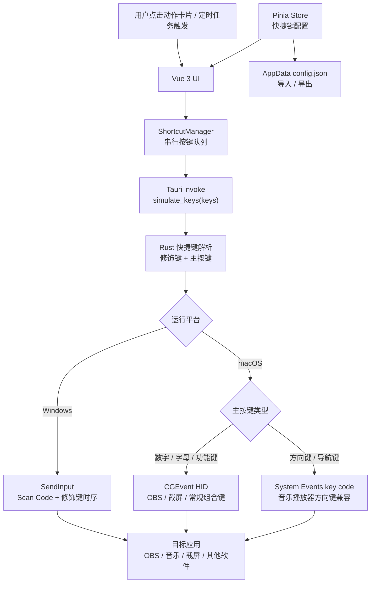

# Shortcut Assistant (快捷键管理助手)

基于 **Tauri 2.0** + **Vue 3** + **Tailwind CSS v4** 构建的现代化桌面快捷键管理与自动化触发工具，支持 Windows 与 macOS 桌面环境。

这款工具的核心设计理念是：**统一管理并驱动其他软件的快捷键**。通过将繁杂的快捷键（如游戏连招、软件动作、OBS场景切换等）收拢到本助手中，以可视化的卡片进行管理，并通过鼠标点击或自动化策略（定时、循环、延时）来精准、极速地触发目标软件。

---

## 🌟 核心特性

- **🚀 快捷触发**：Windows 端使用 `SendInput` 模拟键盘按键，macOS 端按键分流使用 `CGEvent` / `System Events`，适合 OBS、直播工具、常用软件动作等场景。
- **📺 直播控制台主界面**：去掉传统左侧导航，主页面以直播操作台方式组织搜索、筛选、导入导出、视图切换和添加动作。
- **💻 沉浸式直播模式**：一键进入轻量悬浮按键面板。支持窗口置顶（Always on Top）、透明度调节、卡片尺寸调节，边播边点更顺手。
- **⏱️ 多样化触发引擎**：
  - **即时触发**：点按卡片立即执行动作。
  - **延时触发**：点击后倒计时执行，适合需要提前准备操作环境的场景。
  - **循环触发**：设定时间间隔，后台自动重复执行。
  - **定时触发**：每天到达指定时间自动执行。
- **🎨 现代化交互与 UI**：
  - 全新的 Tailwind v4 设计，支持暗色模式，带有磨砂玻璃与细腻动画。
  - 透明无边框窗口经过圆角和外边框抗锯齿优化，整体边缘更顺滑。
  - macOS 标题栏显示左侧红黄绿交通灯，非 macOS 平台保留右侧窗口控制按钮。
  - 最大化按钮支持状态同步，最大化后可一键还原。
  - 卡片支持自由拖拽排序，色彩自定义。
  - 支持多选批量启用、禁用、删除。
- **🪟 小窗口友好弹窗**：设置与添加动作弹窗采用固定头尾、中间滚动和页签分组，避免小窗口显示不全。
- **📦 配置随心迁移**：支持将所有快捷键配置一键导出为 JSON，并在其他设备一键导入。
- **⚙️ 系统级深度集成**：支持开机自动启动、关闭时最小化到系统托盘后台运行。

---

## 🛠️ 技术栈

- **桌面端底座**: [Tauri 2.0](https://v2.tauri.app/)
- **系统层交互**: Rust + Windows `SendInput` / macOS `CGEvent` HID 事件与 `System Events` 导航键兼容模式
- **前端框架**: [Vue 3](https://vuejs.org/) (Composition API) + [Vite](https://vitejs.dev/)
- **状态管理**: [Pinia](https://pinia.vuejs.org/)
- **UI 与样式**: [Tailwind CSS v4](https://tailwindcss.com/) + [Lucide Icons](https://lucide.dev/)
- **拖拽交互**: [SortableJS](https://sortablejs.github.io/Sortable/)
- **持久化与插件**: `@tauri-apps/plugin-fs`、`plugin-dialog`、`plugin-autostart` 等

---

## 🏗️ 架构图



---

## 🚀 快速开始

### 环境依赖
1. [Node.js](https://nodejs.org/) (v18+)
2. [Rust](https://www.rust-lang.org/tools/install) (1.70+)
3. Windows: C++ Build Tools
4. macOS: Xcode Command Line Tools，并在首次触发前按系统提示授予辅助功能权限

### 安装与运行

1. 安装前端依赖
```bash
npm install
```

2. 启动开发环境
```bash
npm run tauri dev
```

3. 构建生产安装包
```bash
npm run tauri build
```
构建成功后，安装包将生成在 `src-tauri/target/release/bundle/` 目录下。

---

## 💡 使用指南

1. **添加动作**：点击顶部「添加」，在「基础 / 按键 / 触发 / 样式」页签中配置名称、图标、快捷键、触发方式和卡片颜色。
2. **录制或手动输入快捷键**：在「按键」页可选择组合录入、分开录入，也可以切换到手动输入模式。
3. **直播模式与置顶**：在顶部控制区点击置顶按钮保持窗口在前，点击直播模式按钮进入悬浮按键面板。
4. **筛选与批量操作**：顶部可按全部、启用、停用筛选动作，也可以切换网格/列表视图并进行批量启用、禁用、删除。
5. **系统设置**：点击顶部设置按钮，按「常规 / 窗口 / 直播 / 外观」页签调整开机自启、透明度、直播卡片尺寸、主题和配色。

---

## 🧩 界面说明

- **主界面**：直播控制台布局，顶部承载主要操作，内容区展示动作卡片。
- **直播模式**：更适合悬浮在直播、游戏或剪辑软件上方使用。
- **设置弹窗**：分组页签设计，小窗口下仍可完整操作。
- **添加动作弹窗**：按配置流程拆分，底部保存按钮始终可见。
- **窗口标题栏**：macOS 自动使用交通灯样式，其他平台使用右侧窗口控制。

---

## 📝 License

MIT License
